# Yield Curve Fitting

## This repository is aimed at fitting empirical and fictional Icelandic spot rate curves to various bond models. 

### The Nelson Siegel Model

The aim of the first problem is to fit a Nelson-Siegel model to the Icelandic non-indexed government bond market. These particular bonds go by the abbreviation "RIKB" followed by the date of their maturity. The problem prompts us to select four different bonds with varying maturity times over which to fit the model. The following table lists the chosen bonds along with their respective specifications as of the 12th of September 2025. 

| Bond       | Maturity Date | Coupon | Last Yield | Frequency |
|------------|--------------|--------|------------|------------|
| RIKB 25 0612 | 12/6/2025  | 8%  | 0.0915  | Annual |
| RIKB 27 0415 | 15/4/2027  | 8%  | 0.0814  | Annual |
| RIKB 31 0124 | 24/1/2031  | 6.5%  | 0.0693  | Annual |
| RIKB 42 0217 | 17/2/2042  | 4.5%  | 0.0635  | Annual |

Having selected the bonds, we proceed to set up their cash flows assuming a principal of 100 and payment times calculated in yearly terms as the difference in days between now and the next payment divided by 365.25. This facilitates the calculation of each bond's dirty price as the sum of its discounted cash flow according to 

$$
    P_{dirty}(0, T) = c_i \sum_{i=1}^{n} \frac{1}{(1+y)^{T_i}} + \frac{100}{(1+y)^{T_n}}
$$

Where $c_i$ is the cash flow at $T_i$ and $y$ is the observed last yield. The following code snippet demonstrates this logic for one of the bonds

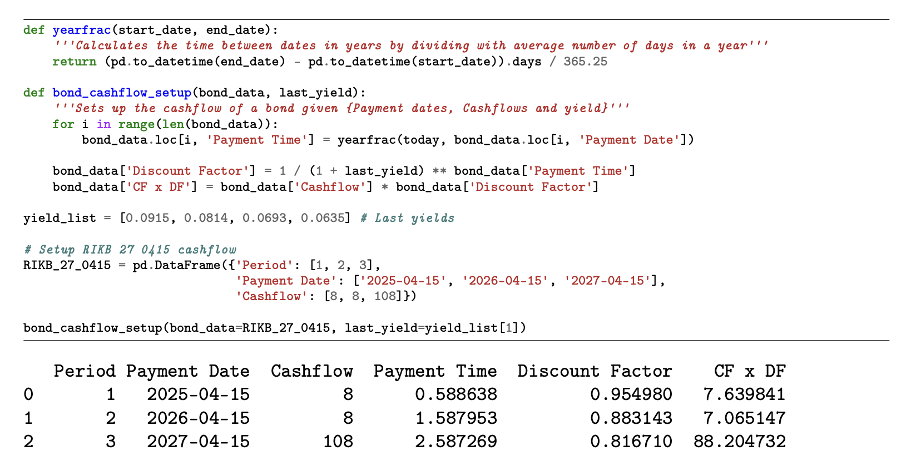

Summing up the discounted cash flows for each bond produces the dirty price vector given by,

$$
\mathbf{P}_{dirty} =
\begin{pmatrix}
    101.1588 \\
    102.9097 \\
    101.9178 \\
    83.3506
\end{pmatrix}
$$

Having calculated the dirty prices of each security we can proceed to fitting the model. The Nelson-Siegel model assumes a parametric functional form for the discount factor $Z(0,T)$ given by

$$
    Z(0, T) = e^{-r(0, T)T} 
$$

Where the continuously compounded yield is given by

$$
r(0, T) = \theta_0 + (\theta_1 + \theta_2)\frac{1-e^{-\frac{T}{\lambda}}}{\frac{T}{\lambda}} - \theta_2 e^{-\frac{T}{\lambda}}
$$

And the terms $\Theta = (\theta_0, \theta_1, \theta_2, \lambda)$ are to be estimated from empirical data. The methodology of estimating the parameters proves to be quite straight-forward; Each bond $i \in \{1,2,3,4\}$ with coupon payment $c_i$ and cash flow payment dates $T_j^i$, for $j = 1,..., n$ can be priced in the Nelson-Siegel model according to 

$$
    P_c^{i, NS} = c_i \sum_{j=1}^{n_i} e^{-(\theta_0 + (\theta_1 + \theta_2)\frac{1-e^{-\frac{T_j}{\lambda}}}{\frac{T_j}{\lambda}} - \theta_2 e^{-\frac{T_j}{\lambda}})T_j} + 100 \cdot e^{-(\theta_0 + (\theta_1 + \theta_2)\frac{1-e^{-\frac{T_{n_i}}{\lambda}}}{\frac{T_{n_i}}{\lambda}} - \theta_2 e^{-\frac{T_{n_i}}{\lambda}})T_{n_i}}
$$

Now for the same bond, we have already calculated the dirty price from empirical data. As such we can compute the square of errors between the model price and empirical price for a given set of elements in $\Theta$, namely

$$
    E(\theta_0, \theta_1, \theta_2, \lambda) = \sum_{i=1}^{4} (P_c^{i, NS} - P_{dirty}^{i})^2
$$

If we optimize the parameters $\theta_0, \theta_1, \theta_2, \lambda$ to minimize $E$, we obtain the set of parameters that best fit the Nelson-Siegel model to the market as seen in the following code snippet

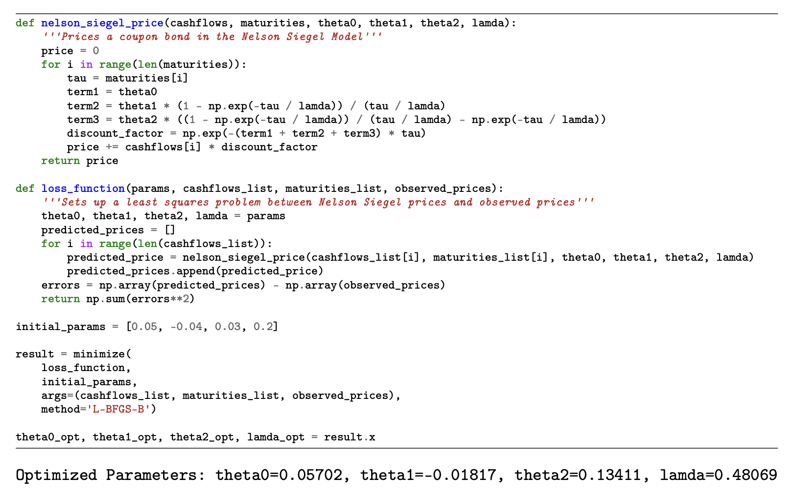

Having optimized the parameters to fit the model prices to those empirically observed, we can move forward and pass the parameters through the pricing function given the same cash flows and maturities as the empirical bonds. Plotting the output alongside the observed data gives us a means to assess our fit.

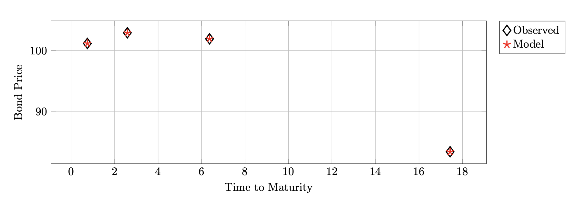

We produce a very good fit with minimal error. Moving closer to the heart of the problem, we plot the discount curve produced by the optimized model parameters as a function of $T$ along with those empirically calculated according to the bond yields. 

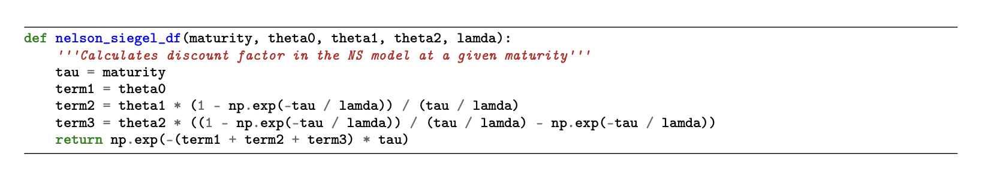

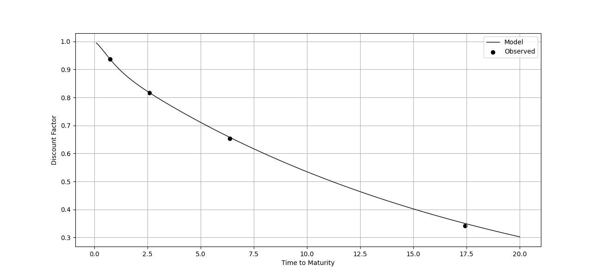

At last, we can extract the annually compounded yields from the model discount factors by solving for $y$ in the formula for the discount factor given annual compounding, namely

$$
    Z(0, T) = \frac{1}{(1 + y)^T} \ \Rightarrow \ y = \left( \frac{1}{Z(0, T)}\right)^{\frac{1}{T}} - 1 
$$

Doing this for all modelled discount factors produces the following plot 

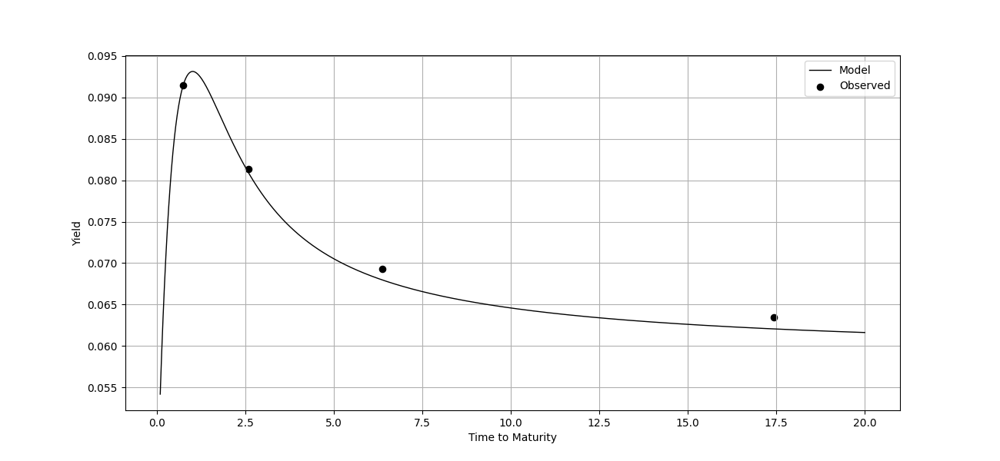

Alternatively, one can simply pass the optimized parameters through the Nelson-Siegel yield formula given by equation above. However, this would result in the continuously compounded yield curve which would not be directly comparable to the observed yields given in annual compounding. To account for the discrepancy, every yield produced by the model should be converted to an annual basis. The following plot aims to visually represent the difference.

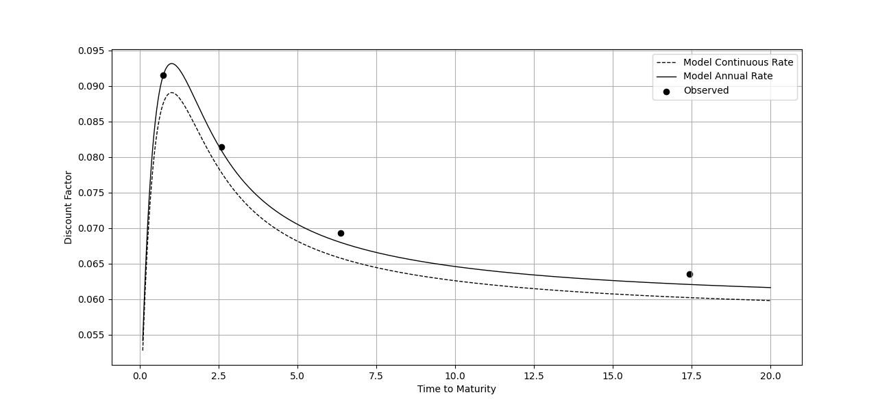

The Nelson-Siegel model shows promising fitment of the bond prices in our case. However, we do see some breakdown in the fit to the yields themselves. This might be caused by the non-linear relationship of bond prices and yields, as prices are inversely related to yields in a convex manner. As such, small changes in yields can have different effects on prices depending on yield level and maturity times. Our model is specifically designed to minimize residuals in the prices rather than yields and does so well. The convexity in the relationship means that the bonds at farther maturities are much more sensitive to yields and as a result, even though the prices are well fit the corresponding yields are less accurate. 

This can be combated by a possible penalty term that balances the fit between prices and yields by introducing some penalty for mismatched yields at long maturities, or possibly by adding the Svensson extension to the model. 

It is also worth mentioning that bonds at farther maturities are normally less liquid which can result in their prices being more noisy. In that case, our model might be indicating a possible trading opportunity as it predicts a lower yield than that which is observed in the market, implying that the bond is underpriced. According to the model, the market might be overestimating the risk or underpricing these long-term bonds, which could signal a buying opportunity. That is to say, if one has good confidence in the models predictive ability. 

### The Vasicek and Ho-Lee Models 

Let a given continuously compounded yield curve, on which to fit firstly the Vasicek model and subsequently the Ho-Lee model be the following. 

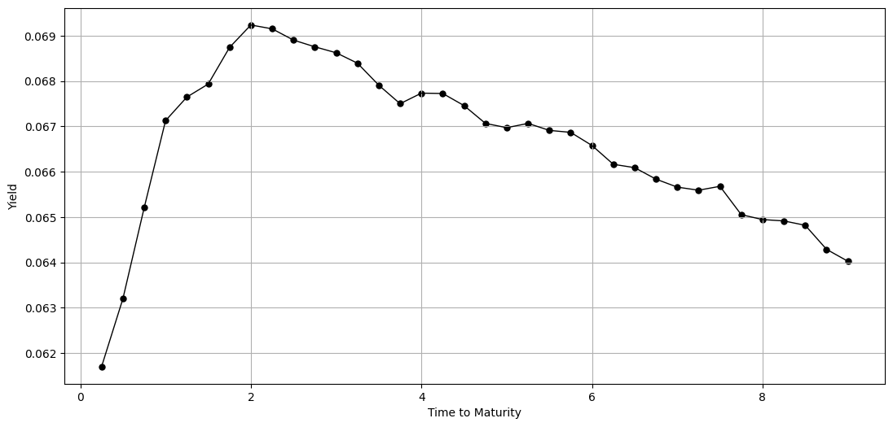

Our first task is then to fit the Vasicek model to the yield curve, given the assumption that $r(0) = 0.06$. To do so we transform the empirical yield curve to the its discount curve counterpart using the formula

$$   
 Z^{\text{Data}}(0, T) = e^{-y^{\text{Data}} (T)}
$$

And then we set up a loss function $J$ of the parameters $\gamma^*, \bar{r}^*,\sigma$ which returns the sum of squared errors between the Vasicek model discount factors and the observed discount factors, that is

$$    
    J(\gamma^*, \bar{r}^*, \sigma) = \sum_{i=1}^n (Z^{\text{Vasicek}}(r_0,0;T_i) - Z^{\text{Data}}(0, T_i))^2
$$

Where, once again, $Z^{\text{Vasicek}}$ is given by

$$
    Z^{\text{Vasicek}}(t, r_0, T) =
$$

$$ e^{\left(\frac{1}{\gamma^*} \left(1 - e^{-\gamma^*(T-t)} \right)-(T-t)\right) \left(\bar{r}^* - \frac{\sigma^2}{2(\gamma^*)^2}\right)-\frac{\sigma^2 \left(\frac{1}{\gamma^*} \left(1 - e^{-\gamma^*(T-t)} \right)\right)^2}{4\gamma^*} - \frac{1}{\gamma^*} \left(1 - e^{-\gamma^*(T-t)} \right)\times r_0} $$

If we then optimize the parameters $\gamma^*, \bar{r}^*,\sigma$ to minimize $J$, we obtain the set of parameters that best fit the Vasicek discount curve to the one observed in the data, as seen in the following code.

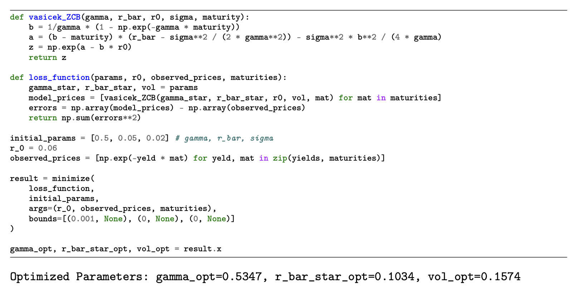

Next, we transform the Vasicek discount factors to their implied countinuously compounded yields according to,

$$    
r^{\text{Vasicek}}(\tau) = -\frac{\ln(Z^{\text{Vasicek}}(r_t, \tau))}{\tau}
$$

Where $\tau$ is the maturity, i.e. $(T-t)$. Doing this allows us to plot the Vasicek model yield curve, i.e. $\tau \mapsto r^{\text{Vasicek}}(\tau)$ to compare with the given c.c. yield curve.

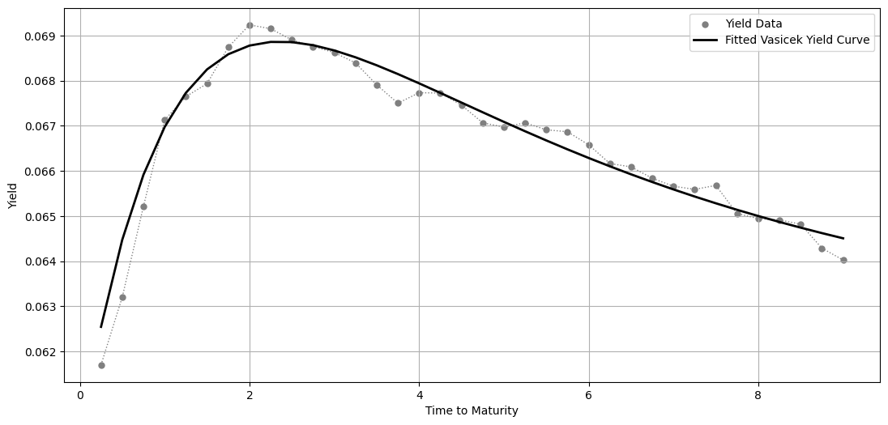

Resulting in a fairly successful fit to the data. However, the parametric nature of the Vasicek model limits the degree to which it can be fit. As such it is not possible to fit the data perfectly.

Moving on, we fit the Ho-Lee model to the same yield data, assuming the same parameter $\sigma$ as what we got when fitting the Vasicek model.

To fit the Ho-Lee model to data, we need to interpolate the spot curve to obtain a smooth twice differentiable spot curve. This can be achieved in a veriaty of ways of interpolation. In our case we use a Cubic Spline interpolation over a fine grid of maturities, to ensure a smooth curve with continuous first and second derivatives. Given a small stepsize $\delta$, we can then calculate the values $r(0, t)$ and $r(0, t+\delta)$ for all maturities on the grid. 

The second step is then to obtain the instantaneous forward curve, which we recall that the c.c. forward rate at time 0 for times between $t$ and $t+\delta$ for small $\delta$ is given by

$$    \lim_{\delta \to 0} f(0, t, t+\delta) = \lim_{\delta \to 0} -\frac{\ln(Z(0, t+\delta))-\ln(Z(0, t))}{\delta} = r(0, t) +  t \times \frac{\partial r(0, t)}{\partial t}
$$

As such we can compute the instantaneous forward curve numerically as $f(0, t) \approx r(0, t) + t \times \frac{r(0, t+\delta)- r(0, t)}{\delta}$. We see that the instantaneous forward curve equals the current spot rate plus a term that depends on the slope of the spot rate curve. 

Finally, we can fit the theta function using the relationship

$$    
\theta_t = \frac{\partial f(0, t)}{\partial t}+ \sigma^2 \times t \approx \frac{f(0, t+\delta) - f(0, t)}{\delta} + \sigma^2 \times t 
$$

Using the same $\sigma$ as estimated earlier. Note, that to ensure numerical stability we must first calculate $f(0, t + \delta) \approx r(0, t+\delta) + t \times \frac{r(0, t+2\delta)- r(0, t+\delta)}{\delta}$.

Thus, we have fitted the Ho-Lee model to the data. To ensure that the methodology is working properly we can use the estimated $\theta_t$ function to check that by inserting it into the spot rate formula given by

$$    
r_0^{\text{Ho-Lee}(T)} = -\frac{\ln(Z(r, 0, T))}{T}
$$

$$
Z(r, 0, T) = e^{-\int_0^T (T-t) \theta_t dt + \frac{T^3}{6} \sigma^2 - T\times r_0}
$$

We obtain model yields that are identical to those used as inputs in the estimation procedure. Where the integral in the formula is approximated according to

$$
    \int_0^T \theta_t (T-t) dt \approx \sum_{j=1}^n \theta_{j\times\delta} \times (T - j\delta)\times\delta
$$

Using these calculations, we can plot a series of figures. Namely, the interpolated spot curve, the instantaneous forward curve, the theta function and the Ho-Lee implied spot rate curve. 

Which results in a sequence of three figures, highlighting the erratic nature of the forward curve and the near perfect fitment of the Ho-Lee yield curve to the one given in the data.

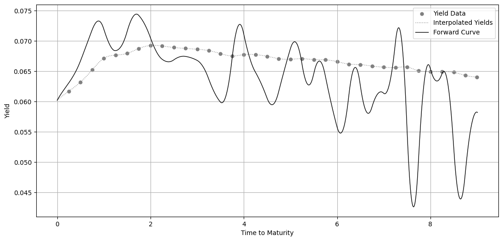
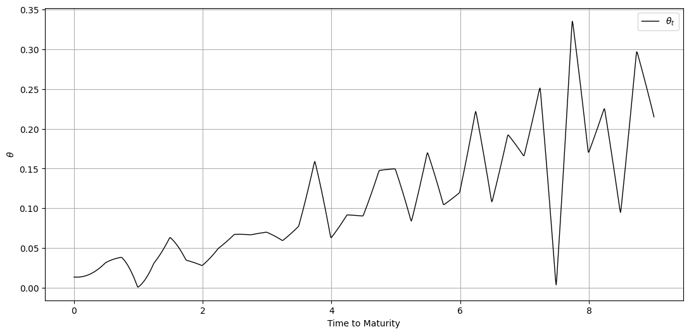
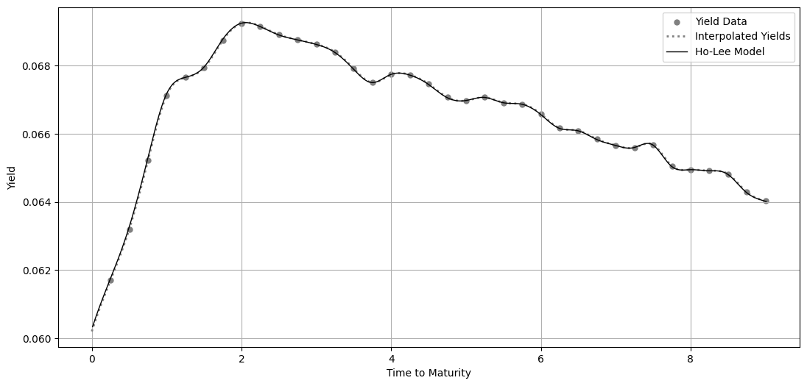

Finally, we assess the goodness of fits of each model by constructing a scatterplot of the difference between implied model yields and actual yields at each maturity.

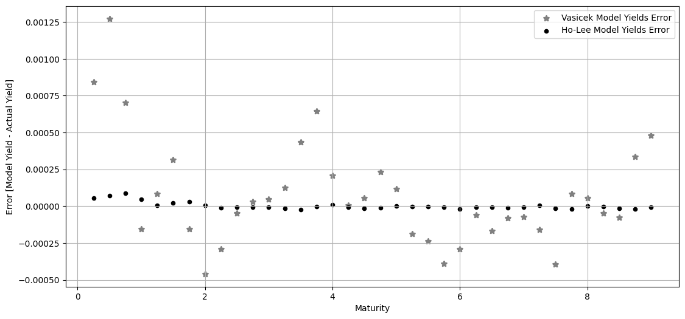

As expected, the Ho-Lee model has a substantially better fitting spot rate curve to the empirical data than that of the Vasicek model as a result of the theta function.
